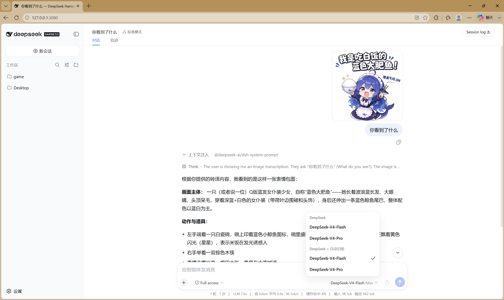
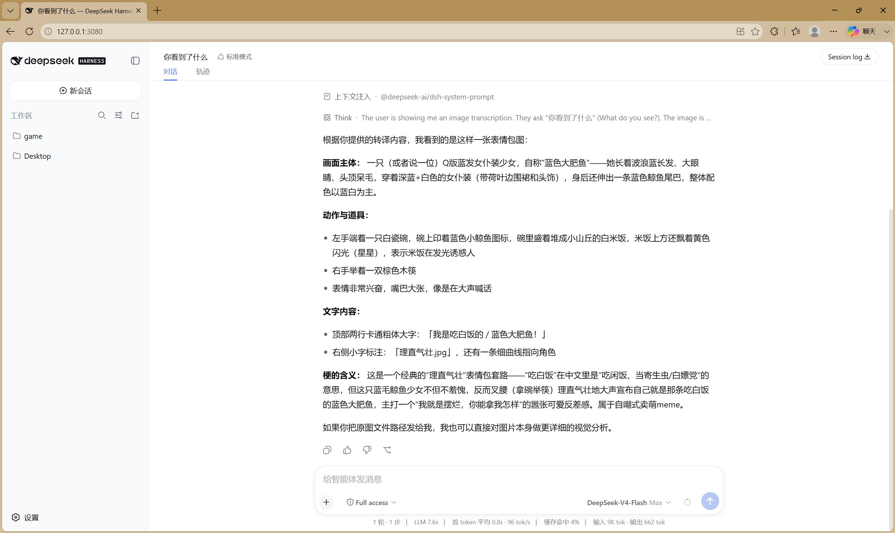

> 📦 **ARCHIVED — final release 0.3.1** — maintenance stopped (no further updates). Code kept for reference/use; since dsh 0.1.1, official vision models (DeepSeek-V4-Flash-Vision-Exp) accept images natively.

# dsh-vision-proxy

[English](README.en-US.md) | [绠€浣撲腑鏂嘳(README.md)

**Keep DeepSeek as the brain 鈥?paste images anyway.** GUI image attachments auto-transcribed for text-only DeepSeek on [DeepSeek Harness](https://github.com/deepseek-ai/deepseek-harness).

<p align="center">
  <a href="https://awesome-dsh-plugin.com"></a>
  <a href="https://www.npmjs.com/package/dsh-vision-proxy"></a>
  <a href="https://github.com/Flyvhidbwo/dsh-vision-proxy/actions/workflows/ci.yml"></a>
  
  
  =22.19" />
  <a href="https://github.com/Flyvhidbwo/dsh-vision-proxy"></a>
</p>

 > ⚠️ **Compatibility & positioning (Aug 2026)**: this plugin now supports dsh 0.1.1-rc.2 (adapter prepareCall contract). Since dsh 0.1.1, DeepSeek natively supports multimodal models (e.g. DeepSeek-V4-Flash-Vision-Exp) — **if you use an official vision model, just attach images, no plugin needed**. This plugin remains useful for: transcription bridging for non-multimodal models, local Ollama (images never leave the machine, free), or custom OpenAI-compatible VLM setups.

## Why this exists

DeepSeek Harness natively gates image attachments on the selected model's declared `inputModalities`. DeepSeek's chat-completions line is text-only, so attaching an image with DeepSeek selected is rejected by design. Tool-based vision plugins exist, but **GUI image attachments still fail** with a text-only model.

This plugin closes that gap: it registers a new provider route (`deepseek-vision`) that wraps the real DeepSeek adapter, claims image input (so the preflight admits attachments), and **transcribes every attached image to text in the request stream** before delegating to DeepSeek. The conversation is still answered by DeepSeek; vision is an add-on.

```
user attaches image 鈹€鈹€鈻?deepseek-vision route 鈹€鈹€鈻?transcribe via VLM (OCR + layout + details)
                          鈹?                         鈹?
                          鈻?                         鈻?
                   DeepSeek answers 鈼€鈹€鈹€ text-only conversation (images replaced by [鍥剧墖杞瘧] text)
```

## Features

- **No hangs, ever.** Anonymous endpoints are hard-capped at 20 s (a hanging free tier can no longer stall a turn for minutes); HTTP 429 on anonymous endpoints fails immediately instead of sleeping on a useless `Retry-After`; endpoints that just failed (429/timeout) are cooled down for 60 s and skipped.
- **Multi-model, multi-provider.** Any OpenAI-compatible VLM endpoint works 鈥?DashScope/Qwen, QwenCloud (international), Zhipu, OpenRouter, local Ollama, or your own. Each `fallbackModels` entry can carry its **own** `baseURL`/`model`, so one install can chain providers.
- **Zero-config local path.** With `autoLocalOllama` (default on), a running Ollama at `http://localhost:11434` is detected at startup and prepended to the fallback chain 鈥?images never leave your machine. No key, no account.
- **Fast, clear failures.** With no key and no local Ollama, transcription fails in seconds with actionable guidance (configure `VISION_API_KEY` / `DASHSCOPE_API_KEY` or install Ollama) 鈥?never a silent stall.
- **Automatic upgrade when you have a key.** Export `VISION_API_KEY` / `DASHSCOPE_API_KEY` and your configured paid endpoint is used automatically (default: DashScope `qwen3.7-flash` 鈥?fast, cheap, no rate limit; DashScope, QwenCloud, Zhipu, OpenRouter, or any OpenAI-compatible endpoint all work); keyless entries are skipped, not failed.
- **Install-time consent prompt.** `postinstall` asks whether you have a VLM API key. Non-interactive environments skip the prompt; the install never hangs. A PRIVACY NOTICE is printed at startup naming the active endpoint.
- **Fallback chain with classified errors.** `rate_limit` / `quota` / `auth` / `region` / `model_not_found` / `context_too_large` / `http` are classified with actionable hints.
- **Content-hash cache.** Transcriptions are cached by the SHA-256 of the image bytes (in-process, capped at 200) 鈥?the same image is transcribed at most once per process, even re-attached or in another conversation.
- **Auto-downscale (optional).** With `sharp` installed, images above `maxImagePixels` are downscaled before transcription 鈥?fewer image tokens, much faster on big screenshots. Degrades gracefully without sharp.
- **`read_image` compatible.** The native `read_image` tool also works on this route (its capability gate reads the same model info).

## Supported models & providers

One config (`baseURL` + `model`, optionally `apiKey`) covers every backend:

| Scenario | baseURL | model | Notes |
|---|---|---|---|
| **DashScope (China)** 鈥?default main | `https://dashscope.aliyuncs.com/compatible-mode/v1` | `qwen3.7-flash` / `qwen3-vl-flash` | Cheap, fast, no rate limit. Keys: `sk-ws-鈥 from [platform.qianwenai.com](https://platform.qianwenai.com) or `sk-鈥 from [bailian.console.aliyun.com](https://bailian.console.aliyun.com) |
| **Local Ollama (auto-detected)** | `http://localhost:11434/v1` | first vision-capable model | Zero config when installed; images never leave the machine |
| **QwenCloud (intl.)** | `https://dashscope-intl.aliyuncs.com/compatible-mode/v1` | `qwen3-vl-plus` etc. | International variant |
| **Zhipu (free tier)** | `https://open.bigmodel.cn/api/paas/v4` | `glm-4.6v-flash` | Free tier, still needs a (free) Zhipu API key |
| **Anything OpenAI-compatible** | your endpoint | your model | OpenRouter, Ark, vLLM, gateways鈥?the plugin only speaks `/chat/completions` |

> 鈿狅笍 **Anonymous third-party free tiers are NOT bundled as a default fallback.** In field testing, anonymous free endpoints (e.g. OVHcloud AI Endpoints) were strictly rate-limited AND occasionally hung without a response 鈥?as a default they just reproduce a broken experience. If you still want to point at one, add it yourself via `fallbackModels` with `anonymous: true` (the 20 s cap still applies).

### Pricing (CNY, Alibaba Model Studio mainland, Aug 2026 reference)

| Model | Input | Output | One 1080p screenshot (鈮?000 tokens) |
|---|---|---|---|
| qwen3-vl-flash | 楼0.15 / 1M tokens | 楼1.5 / 1M tokens | 鈮?楼0.0005 (0.05 fen) |
| qwen3.7-flash | 楼0.2 / 1M tokens | 楼0.8 / 1M tokens | 鈮?楼0.001 (0.1 fen) |
| Local Ollama | free | free | 楼0 (images never leave the machine) |

> Images are billed by token (providers convert image resolution into tokens; a 1080p screenshot 鈮?2000 tokens). At the prices above **one image costs well under one li** (0.001 CNY); even heavy use (100 images/day) is only a few yuan a month. Local Ollama is completely free. Always check the console for live pricing.

**Key resolution order**: config `apiKey` 鈫?`$VISION_API_KEY` 鈫?`$DASHSCOPE_API_KEY`. Anonymous endpoints (`anonymous: true`) and local hosts need no key; keyless non-anonymous entries are skipped automatically.

## Quick start

```sh
dsh plugin --profile web add dsh-vision-proxy
```

During install you are asked one question 鈥?*do you have a VLM API key?* Answer `y` for the paid fast path, or `N` (default) for the local/zero-config path. Restart `dsh web`, pick **DeepSeek + 鑷姩璇嗗浘** in the model selector, then paste an image into any conversation.

**pnpm 鈮?10 blocks dependency build scripts by default** 鈥?the first install exits non-zero with `Ignored build scripts: dsh-vision-proxy, sharp`. Approve both (the plugin's consent prompt and `sharp`'s optional binary), then re-run the install to finish bundle registration:

```yaml
# in the profile's pnpm-workspace.yaml
allowBuilds:
  dsh-vision-proxy: true
  sharp: true
```

```sh
dsh plugin --profile web add dsh-vision-proxy   # re-run after approving
```

> **Slow npm registry in China?** `dsh plugin --profile web add dsh-vision-proxy --registry=https://registry.npmmirror.com` (the flag is forwarded to pnpm).

## Live demo: a real GUI image turn

A real conversation on the `deepseek-vision` route (DeepSeek-V4-Flash as the brain): the user pasted a meme and asked **"浣犵湅鍒颁簡浠€涔?** (what do you see?); the image was auto-transcribed by the VLM and DeepSeek answered from the text 鈥?one step, ~7.6 s.

<p align="center">
  
  
</p>

*Left: the model picker showing the `deepseek-vision` route (**DeepSeek + 鑷姩璇嗗浘**) selected 鈥?that is what admits image attachments. Right: DeepSeek's full answer derived from the transcribed image text.*

```
user pastes a meme image + "浣犵湅鍒颁簡浠€涔?
  鈫?image block auto-transcribed via the VLM (OCR + layout):
      "鎴戞槸鍚冪櫧楗殑 / 钃濊壊澶ц偉楸硷紒 (鐞嗙洿姘斿．.jpg) 鈥?Q-version blue-haired maid girl
       with a whale tail, holding a bowl of rice and chopsticks, excited expression"
  鈫?DeepSeek answers with a full visual analysis of the meme
```

Two autonomous paths are covered: the `view_image` tool (any route, file paths & URLs) and image-block auto-transcription (on the `deepseek-vision` route 鈥?images you attach mid-conversation).

## Configuration

The bundle already ships sensible defaults (see the strategy above) 鈥?you normally don't need to configure anything. To override them in your profile, use an **id-targeted override**, NOT an `insert` (see the warning below):

```yaml
# $DSH_HOME/profiles/web/cordis.patch.yml 鈥?user-layer override example
- id: dsh-vision-proxy
  name: 'dsh-vision-proxy'
  config:
    baseURL: https://dashscope.aliyuncs.com/compatible-mode/v1
    apiKey: 'sk-鈥?          # or leave '' to read env vars (writing it here is the reliable way on Windows)
    model: qwen3.7-flash
    maxTokens: 4096
    timeoutMs: 120000       # anonymous endpoints are hard-capped at 20 s anyway
    maxImagePixels: 4000000
    marker: '[鍥剧墖杞瘧]'
    autoLocalOllama: true
    fallbackModels: []      # add your own {model, baseURL, apiKey?, anonymous?, timeoutMs?}
```

> 鈿狅笍 **Do NOT write this as `- insert: [{id: dsh-vision-proxy, 鈥]`.** In dsh's patch semantics an `insert` **appends** entries to the list 鈥?the bundle's own entry and yours (same id) would both be instantiated, registering the `deepseek-vision` adapter **twice** (undefined behavior). A top-level `- id:` entry targets the existing row and **replaces its whole `config`**; keys you omit fall back to the plugin schema's `.default()` values (e.g. `maxTokens=4096`, `timeoutMs=120000`, `autoLocalOllama=true`), so writing only `apiKey`/`model` also works.

| Key | Default | Meaning |
|---|---|---|
| `providerId` | `deepseek-vision` | Route id shown in the model picker |
| `innerProvider` | `deepseek-official` | Existing adapter route to wrap |
| `baseURL` | DashScope compatible-mode | OpenAI-compatible VLM endpoint (any vendor, Ollama included) |
| `apiKey` | `''` | VLM key; falls back to `$VISION_API_KEY`, then `$DASHSCOPE_API_KEY`. On Windows, environment changes may not reach a running dsh 鈥?writing `apiKey` here is the reliable way |
| `anonymous` | `false` | Skip the Authorization header (for registration-free endpoints; 20 s timeout cap applies) |
| `model` | `qwen3.7-flash` | Vision model id (e.g. `Qwen2.5-VL-72B-Instruct`, `qwen3-vl-flash`, `glm-4.6v-flash`, `qwen3-vl:4b`) |
| `maxTokens` | `4096` | VLM output cap (thinking models spend tokens on reasoning first) |
| `timeoutMs` | `120000` | VLM request timeout (anonymous endpoints are capped at 20 s regardless) |
| `maxImagePixels` | `4000000` | Images above this are downscaled before transcription when `sharp` is installed (0 disables) |
| `marker` | `[鍥剧墖杞瘧]` | Marker prepended to each transcription |
| `failureMode` | `placeholder` | Behavior when every VLM fails for an image: `placeholder` (default) inserts `[图片转译失败: ...]` text and the conversation continues - a dead endpoint can no longer poison the session; `error` fails the whole turn (legacy) |
| `autoLocalOllama` | `true` | Probe `http://localhost:11434` at startup; when found, prepend it to the fallback chain |
| `localOllamaModel` | `''` | Ollama model id; empty picks the first vision-capable model the local Ollama reports |
| `fallbackModels` | `[]` | Ordered fallback list `{model, baseURL?, apiKey?, anonymous?, timeoutMs?}` 鈥?each entry may point at a **different provider**; keyless non-anonymous entries are skipped |

> **About API keys on Windows**: `dsh --profile <name> --dump-config` prints the composed config as-is (so a key in `cordis.patch.yml` shows in plaintext dumps), but environment variables set after a process started (explorer.exe caches them) may never reach a running dsh. If you see `skipped 鈥?no API key` despite having exported the key, **write `apiKey` directly into the plugin config** 鈥?it is the only reliable path on Windows. (Note: dsh rc.6 does NOT load `.env` files, so that is not an alternative.)

## Verify the install

```sh
dsh --profile web --dump-config | grep -A3 dsh-vision-proxy   # exactly ONE entry (note: dumps config in plaintext, key included)
```

1. Restart `dsh web` 鈫?the model picker shows **DeepSeek + 鑷姩璇嗗浘**.
2. Paste an image into a conversation 鈫?you should see the `[鍥剧墖杞瘧]` marker followed by DeepSeek's answer.
3. With no key and no local Ollama, the turn should fail **fast** (seconds) with the guidance message 鈥?that is the intended no-hang behavior.

## Behavior notes

- Only messages containing image blocks are touched; plain-text conversations hit DeepSeek with zero overhead.
- Anonymous endpoints: 20 s hard timeout cap, HTTP 429 fails immediately (no retry), failures arm a 60 s endpoint cooldown 鈥?consecutive images don't re-hit a broken endpoint.
- The request only fails after every chain entry failed, with one error listing each attempt plus actionable guidance.
- Transcription results are cached in-process by image content hash (never persisted).
- On startup the plugin logs a one-line summary 鈥?route id, wrapped provider, VLM model, endpoint, timeout, maxTokens, apiKey source and fallback list (the key itself is never logged), plus a PRIVACY NOTICE and a local-Ollama detection line.
- Tested: 14 unit tests on Node 22 and 24 via GitHub Actions (incl. no-hang fast-fail, cooldown skip, and Ollama detection).
- Transcription quality: dense UI screenshots may lose small text details 鈥?that is the vision model's capability ceiling, not a plugin bug. For OCR-heavy work, use a stronger model (e.g. `qwen3-vl-plus`) or raise `maxTokens`.

## Troubleshooting

| Symptom | Cause & fix |
|---|---|
| `skipped 鈥?no API key` despite exporting `VISION_API_KEY` | Windows caches environment variables in explorer.exe; the running dsh never saw them. Write `apiKey` directly into the plugin config, then restart dsh |
| `Ignored build scripts: dsh-vision-proxy, sharp` on install | pnpm 鈮?10 blocks dependency build scripts. Add `allowBuilds: {dsh-vision-proxy: true, sharp: true}` to the profile's `pnpm-workspace.yaml`, then re-run the install |
| `ERR_PNPM_MINIMUM_RELEASE_AGE_VIOLATION` on a fresh release day | pnpm 11 defaults `minimumReleaseAge` to 1 day (supply-chain policy). Add `minimumReleaseAge: 0` to the profile's `pnpm-workspace.yaml`, or pass `--config.minimum-release-age=0` to `dsh plugin add`, then re-run |
| `all N vision model(s) failed 鈥?rate_limit` on an anonymous endpoint | Anonymous free tiers are strictly rate-limited and may hang. Configure a key or use local Ollama |
| Turn stalls ~20 s then fails on a fresh install with no key | No key and no local Ollama 鈥?that is the intended fast-fail path. Install Ollama or add a key |
| Slow downloads from registry.npmjs.org | Use `--registry=https://registry.npmmirror.com` (forwarded to pnpm) |

## Privacy

Transcription sends image bytes (base64, over HTTPS) to the configured VLM endpoint 鈥?**the image data leaves your machine** unless `baseURL` points at a local service (e.g. Ollama). Nothing is stored beyond the harness's own attachment store. For sensitive images, use your own endpoint or a local model 鈥?or don't install.

## How it works (for plugin developers)

The plugin uses only public harness seams, stable on rc.6:

- `ctx.llm.registration(innerProvider).adapter` 鈥?reach the wrapped adapter;
- `ctx.llm.registerAdapter([providerId], proxyAdapter)` 鈥?register a NEW route (no `DUPLICATE_ADAPTER` conflict);
- proxy `resolveModel` overrides `inputModalities` to `['text', 'image']` 鈥?satisfies the attachment preflight (`api-proxy`) and the `read_image` gate (`dsh-tool-fs`);
- proxy `stream` transcribes image blocks (shape `{ type: 'image', attachment }`, bytes via `ctx.get('attachments').readImage(ref)`) and `yield*`s the inner adapter's stream unchanged.

## License

MIT
