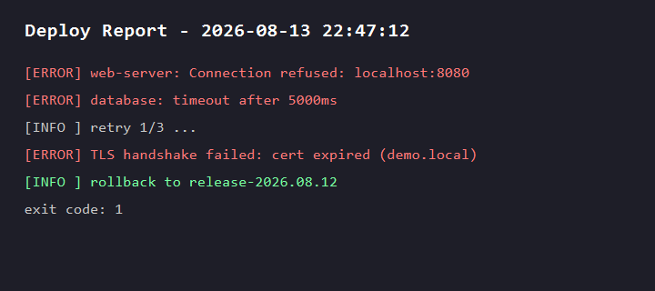

# dsh-vision-proxy

[English](README.md) | [简体中文](README.zh-CN.md)

**DeepSeek 大脑 + 自动识图** —— 为 [DeepSeek Harness](https://github.com/deepseek-ai/deepseek-harness) 打造的代理路由插件。

保持 DeepSeek（纯文本线路）作为对话大脑，同时也能在 Web 界面直接附加图片——每条图片消息都会自动经 OpenAI 兼容 VLM（默认 DashScope `qwen3.7-flash`）转译成文字，再交给 DeepSeek 作答。

## 为什么需要它

DeepSeek Harness 原生按模型声明的 `inputModalities` 决定是否放行图片附件。DeepSeek 的 chat-completions 线路是纯文本的，所以选中 DeepSeek 时附加图片会被原生拒绝。已有的视觉插件提供 `view_image` *工具*（适用于文件路径），但 GUI 图片*附件*依然被拒。

本插件补上这个缺口：注册一条新提供商路由（`deepseek-vision`），包装真正的 DeepSeek 适配器——对外声明支持图片输入（附件预检放行），并在请求流里**把每张图片转译成文字**后再委托给 DeepSeek。对话仍然由 DeepSeek 作答，识图只是附加能力。

```
用户附加图片 ──▶ deepseek-vision 路由 ──▶ 经 qwen3.7-flash 转译（OCR+版式+细节）
                   │                        │
                   ▼                        ▼
            DeepSeek 作答 ◀── 纯文本对话（图片已替换为 [图片转译] 文字）
```

## 现场演示：工作中途的自主识图

下面就是本插件开启的完整链路。在一次"部署检查"任务中，工具返回了一张截图路径；模型**自主决定要看图**，调用了 `view_image`——代理把图片经 VLM 转译成文字，模型基于文字继续分析并作答。



**调用链**

```
任务：分析这份部署报告
  → 工具返回 deploy-report.png（一个文件路径）
  → 模型自主调用 view_image("deploy-report.png", "逐行准确读出所有文字")
  → qwen3.7-flash 转译（OCR + 版式）：
      "Deploy Report - 2026-08-13 22:47:12
       [ERROR] web-server: Connection refused: localhost:8080
       [ERROR] database: timeout after 5000ms
       [INFO ] retry 1/3 ...
       [ERROR] TLS handshake failed: cert expired (demo.local)
       [INFO ] rollback to release-2026.08.12
       exit code: 1"
  → 模型基于文字分析故障原因并回答
```

两条自主路径都覆盖：

- **`view_image` 工具（任意路由）**：只要图片有意义——工具返回的截图路径、图片 URL、图表、UI 草图——模型会自己调用它，而不是猜测或拒绝。
- **图片块自动转译（`deepseek-vision` 路由）**：对话中途附加的图片会自动转译进下一条请求，DeepSeek 永远只看到纯文本对话。

## 安装

```sh
dsh plugin --profile web add github:Flyvhidbwo/dsh-vision-proxy
# 发布到 npm 后：dsh plugin --profile web add dsh-vision-proxy
# 或经插件管理器（Marisa / dshx）：dshx install dsh-vision-proxy <url>
```

无构建步骤：插件以编译好的 `lib/` 直接入库，git 安装即可用（无需 `prepare` 脚本，也无需 pnpm `allowBuilds` 授权）。包声明了 `dsh.bundle`，安装后会自动加入 profile 的组合包层。

安装后重启 `dsh web`，在模型选择器里选 **DeepSeek + 自动识图 → DeepSeek-V4-Flash**（或内部 DeepSeek 路由暴露的任意模型）。

要求：`dsh` >= 0.1.0-rc.6，Node >= 22.19，且 PATH 上有 `pnpm`（`dsh plugin` 命令会转发给 pnpm）。

> **从本地目录安装**（如 `dsh plugin --profile web add /path/to/dsh-vision-proxy`）生成的是 `link:` 依赖，pnpm 不会为 link 包安装其自身依赖——装完后需在插件目录里执行一次 `pnpm install`（唯一运行时依赖是 `schemastery`）。

## 配置

配置位于插件行（以下为 bundle 默认值；可在你的 profile 的 `cordis.patch.yml` 中覆盖）：

```yaml
- insert:
    - id: dsh-vision-proxy
      name: 'dsh-vision-proxy'
      config:
        baseURL: https://dashscope.aliyuncs.com/compatible-mode/v1
        apiKey: ''            # 留空则读环境变量
        model: qwen3.7-flash
        maxTokens: 2048
        timeoutMs: 60000
        marker: '[图片转译]'
```

| 键 | 默认值 | 含义 |
|---|---|---|
| `providerId` | `deepseek-vision` | 模型选择器中显示的路由 id |
| `innerProvider` | `deepseek-official` | 被包装的现有适配器路由 |
| `baseURL` | DashScope 兼容模式 | OpenAI 兼容 VLM 端点（任意厂商，含 Ollama） |
| `apiKey` | `''` | VLM 密钥；回退读取 `$VISION_API_KEY`，再回退 `$DASHSCOPE_API_KEY` |
| `model` | `qwen3.7-flash` | 视觉模型 id（如 `qwen3-vl-flash`、`glm-4.6v-flash`，本地 Ollama 可用 `qwen3-vl:4b`） |
| `maxTokens` | `2048` | VLM 输出上限 |
| `timeoutMs` | `60000` | VLM 请求超时 |
| `marker` | `[图片转译]` | 每条转译文本前加的前缀标记 |

### 在 profile 中覆盖

```yaml
# 例如 $DSH_HOME/profiles/web/cordis.patch.yml
# 注意：按 id 定位的 patch 会【整体替换】config 对象——不是深合并——
# 想保留的键必须全部写上。
- id: dsh-vision-proxy
  config:
    baseURL: https://dashscope.aliyuncs.com/compatible-mode/v1
    apiKey: 'sk-…'            # 或留空，改用环境变量 VISION_API_KEY
    model: qwen3.7-flash
    maxTokens: 2048
    timeoutMs: 60000
    marker: '[图片转译]'
```

> **建议优先用 `VISION_API_KEY` 环境变量，而不是把密钥写进 patch 文件**：`dsh --profile <name> --dump-config` 会原样打印合成后的配置，写在 `cordis.patch.yml` 里的密钥会明文出现在 dump 输出中。

### 端点说明

- **千问 / DashScope（国内）**：保持默认 `baseURL`（`https://dashscope.aliyuncs.com/compatible-mode/v1`）。密钥来自 [platform.qianwenai.com](https://platform.qianwenai.com)（通用 API Key 为 `sk-ws-…` 格式，Token Plan 为 `sk-sp-…` 格式），或 [bailian.console.aliyun.com](https://bailian.console.aliyun.com)（`sk-…` 格式）。`qwen3.7-flash` 多模态且便宜。
- **QwenCloud（国际版）**：`https://dashscope-intl.aliyuncs.com/compatible-mode/v1`。
- **智谱**：`https://open.bigmodel.cn/api/paas/v4` + `glm-4.6v-flash`（有免费档）。
- **本地 Ollama**：`http://localhost:11434/v1` + 任意视觉模型，无需密钥。

## 行为说明

- 只有含图片块的消息才会被处理；纯文本对话零开销直达 DeepSeek。
- 转译结果按 `attachmentId` 缓存（进程内，上限 100 条），同一张图每个进程最多转译一次。
- `read_image` 工具在该路由下同样可用（其能力门禁读取的是同一份模型信息）。
- 启动时插件会打印一行摘要日志——路由 id、被包装的 provider、VLM 模型、端点和 apiKey 来源（永远不会打印密钥本身）。发图前可以先看这行确认当前生效的 VLM。
- 若 VLM 失败（网络 / 额度 / 缺密钥），请求会以明确报错失败，而不是静默丢弃图片；401/403 时错误信息里会附上核对密钥格式的提示。

## 实现原理（给插件开发者）

本插件只使用 rc.6 上稳定的公共接口：

- `ctx.llm.registration(innerProvider).adapter` —— 拿到被包装的适配器；
- `ctx.llm.registerAdapter([providerId], proxyAdapter)` —— 注册新路由（无 `DUPLICATE_ADAPTER` 冲突）；
- 代理 `resolveModel` 把 `inputModalities` 覆盖为 `['text', 'image']` —— 满足附件预检（`api-proxy`）与 `read_image` 门禁（`dsh-tool-fs`）；
- 代理 `stream` 转译图片块（结构 `{ type: 'image', attachment }`，字节经 `ctx.get('attachments').readImage(ref)` 获取），再 `yield*` 原样转发内部适配器的流。

## 许可证

MIT
